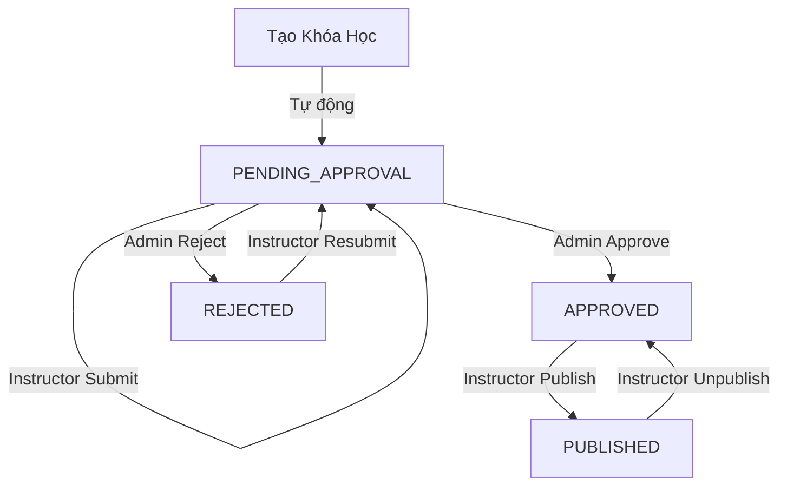
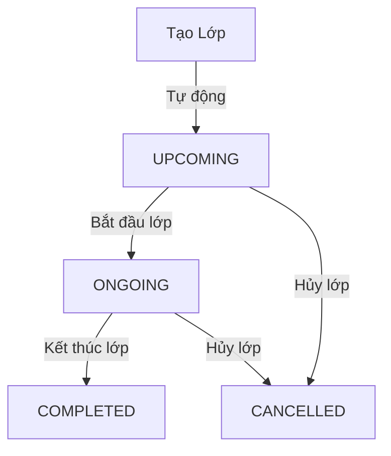
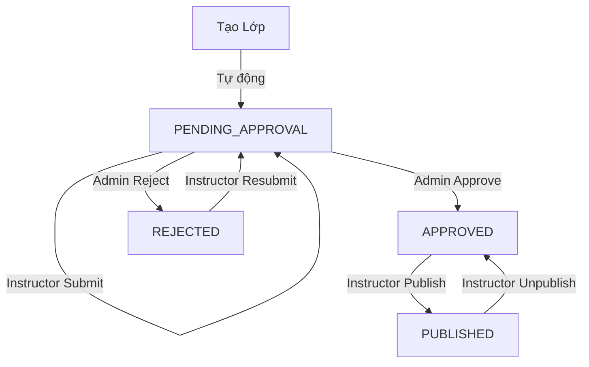

# 📚 Hệ Thống Quản Lý Trạng Thái Khóa Học & Lớp Học (Course & Class Status Management)

## 📋 Mục Lục

- [Tổng Quan](#tổng-quan)
- [Thay Đổi Schema](#thay-đổi-schema)
- [Course Status Workflow](#course-status-workflow)
- [Class Status Workflow](#class-status-workflow)
- [Lesson Status Workflow](#lesson-status-workflow)
- [API Documentation](#api-documentation)
- [Migration Guide](#migration-guide)
- [Examples](#examples)

---

## 🎯 Tổng Quan

Hệ thống quản lý đã được nâng cấp toàn diện với 3 hệ thống xét duyệt độc lập:

1. **Course Status**: Quản lý khóa học (CourseStatus enum)
2. **Class Status**: Quản lý lớp học với 2 tầng trạng thái:
   - `ClassStatus`: Trạng thái vòng đời (UPCOMING, ONGOING, COMPLETED, CANCELLED)
   - `ClassStatusActive`: Trạng thái xét duyệt (PENDING_APPROVAL, APPROVED, REJECTED, PUBLISHED)
3. **Lesson Status**: Quản lý bài học (LessonStatus enum)

Điều này cho phép admin kiểm duyệt từng thành phần riêng biệt trước khi xuất bản.

### Lợi Ích

✅ **Kiểm soát chất lượng đa tầng**: Admin duyệt Course, Class, và Lesson riêng biệt  
✅ **Quy trình rõ ràng**: Workflow từ tạo → duyệt → xuất bản cho từng thành phần  
✅ **Truy vết đầy đủ**: Lưu lại thời gian và người duyệt cho tất cả  
✅ **Phản hồi chi tiết**: Lý do từ chối giúp instructor cải thiện từng phần  
✅ **Độc lập**: Có thể duyệt lesson mà không cần duyệt toàn bộ course  
✅ **Linh hoạt**: Class có thể ở trạng thái ONGOING nhưng vẫn chờ admin duyệt xuất bản

---

## 🔄 Thay Đổi Schema

### Trước Đây (Old Schema)

```prisma
model Course {
  id          String   @id @default(uuid())
  title       String
  isPublished Boolean  @default(false) // ❌ Chỉ có 2 trạng thái
  // ... other fields
}

model Class {
  id          String   @id @default(uuid())
  name        String
  isPublished Boolean  @default(false) // ❌ Chỉ có 2 trạng thái
  // ... other fields
}

model Lesson {
  id          String   @id @default(uuid())
  title       String
  isPublished Boolean  @default(false) // ❌ Chỉ có 2 trạng thái
  // ... other fields
}
```

### Hiện Tại (New Schema)

```prisma
// === ENUMS ===
enum CourseStatus {
  PENDING_APPROVAL  // Chờ admin duyệt
  APPROVED          // Admin đã duyệt, sẵn sàng xuất bản
  REJECTED          // Admin từ chối
  PUBLISHED         // Đã xuất bản công khai
}

enum ClassStatus {
  UPCOMING    // Sắp diễn ra
  ONGOING     // Đang diễn ra
  COMPLETED   // Đã hoàn thành
  CANCELLED   // Đã hủy
}

enum ClassStatusActive {
  PENDING_APPROVAL  // Chờ admin duyệt xuất bản
  APPROVED          // Admin đã duyệt, sẵn sàng xuất bản
  REJECTED          // Admin từ chối xuất bản
  PUBLISHED         // Đã xuất bản công khai
}

enum LessonStatus {
  PENDING_APPROVAL  // Chờ admin duyệt
  APPROVED          // Admin đã duyệt, instructor có thể publish
  REJECTED          // Admin từ chối
  PUBLISHED         // Instructor đã xuất bản
}

// === MODELS ===
model Course {
  id              String       @id @default(uuid())
  title           String
  status          CourseStatus @default(PENDING_APPROVAL) // ✅ 4 trạng thái

  // 🆕 Các trường mới
  rejectionReason String?      // Lý do từ chối
  submittedAt     DateTime?    // Thời điểm gửi duyệt
  reviewedAt      DateTime?    // Thời điểm admin duyệt
  publishedAt     DateTime?    // Thời điểm xuất bản

  // 🆕 Quan hệ với admin
  reviewer        User?   @relation("CourseReviewer", fields: [reviewedById], references: [id])
  reviewedById    String?

  // ... other fields
}

model Class {
  id           String            @id @default(uuid())
  name         String
  status       ClassStatus       @default(UPCOMING)        // ✅ Vòng đời lớp học
  statusActive ClassStatusActive @default(PENDING_APPROVAL) // ✅ Trạng thái xét duyệt

  // 🆕 Các trường mới
  rejectionReason String?      // Lý do từ chối
  submittedAt     DateTime?    // Thời điểm gửi duyệt
  reviewedAt      DateTime?    // Thời điểm admin duyệt
  publishedAt     DateTime?    // Thời điểm xuất bản

  // 🆕 Quan hệ với admin
  reviewer        User?   @relation("ClassReviewer", fields: [reviewedById], references: [id])
  reviewedById    String?

  // ... other fields
}

model Lesson {
  id              String       @id @default(uuid())
  title           String
  status          LessonStatus @default(PENDING_APPROVAL) // ✅ 4 trạng thái

  // 🆕 Các trường mới
  rejectionReason String?      // Lý do từ chối
  submittedAt     DateTime?    // Thời điểm gửi duyệt
  reviewedAt      DateTime?    // Thời điểm admin duyệt
  publishedAt     DateTime?    // Thời điểm xuất bản

  // 🆕 Quan hệ với admin
  reviewer        User?   @relation("LessonReviewer", fields: [reviewedById], references: [id])
  reviewedById    String?

  // ... other fields
}
```

### Các Trường Mới

#### Course Fields

| Trường            | Type           | Mô Tả                               |
| ----------------- | -------------- | ----------------------------------- |
| `status`          | `CourseStatus` | Trạng thái xét duyệt của khóa học   |
| `rejectionReason` | `String?`      | Lý do admin từ chối (nếu bị reject) |
| `submittedAt`     | `DateTime?`    | Thời điểm instructor gửi duyệt      |
| `reviewedAt`      | `DateTime?`    | Thời điểm admin xem xét             |
| `publishedAt`     | `DateTime?`    | Thời điểm xuất bản công khai        |
| `reviewedById`    | `String?`      | ID của admin đã duyệt               |

#### Class Fields

| Trường            | Type                | Mô Tả                                             |
| ----------------- | ------------------- | ------------------------------------------------- |
| `status`          | `ClassStatus`       | Vòng đời lớp học (UPCOMING → ONGOING → COMPLETED) |
| `statusActive`    | `ClassStatusActive` | Trạng thái xét duyệt xuất bản                     |
| `rejectionReason` | `String?`           | Lý do admin từ chối xuất bản                      |
| `submittedAt`     | `DateTime?`         | Thời điểm instructor gửi duyệt                    |
| `reviewedAt`      | `DateTime?`         | Thời điểm admin xem xét                           |
| `publishedAt`     | `DateTime?`         | Thời điểm xuất bản công khai                      |
| `reviewedById`    | `String?`           | ID của admin đã duyệt                             |

#### Lesson Fields

| Trường            | Type           | Mô Tả                               |
| ----------------- | -------------- | ----------------------------------- |
| `status`          | `LessonStatus` | Trạng thái xét duyệt của bài học    |
| `rejectionReason` | `String?`      | Lý do admin từ chối (nếu bị reject) |
| `submittedAt`     | `DateTime?`    | Thời điểm instructor gửi duyệt      |
| `reviewedAt`      | `DateTime?`    | Thời điểm admin xem xét             |
| `publishedAt`     | `DateTime?`    | Thời điểm xuất bản                  |
| `reviewedById`    | `String?`      | ID của admin đã duyệt               |

---

## 🔄 Course Status Workflow

### Sơ Đồ Trạng Thái



## 🏫 Class Status Workflow

### Sơ Đồ Trạng Thái Kép

Class có 2 hệ thống trạng thái độc lập:

#### 1. Vòng đời Class (ClassStatus)



#### 2. Trạng thái Xuất bản (ClassStatusActive)



**Lưu ý**: Một lớp có thể đang ONGOING nhưng vẫn ở trạng thái PENDING_APPROVAL cho việc xuất bản công khai.

## 📝 Lesson Status Workflow

### Sơ Đồ Trạng Thái


### Chi Tiết Workflow

#### Course Status

#### 1️⃣ **PENDING_APPROVAL** (Chờ Duyệt)

- **Khi nào**: Khi instructor tạo khóa học mới hoặc resubmit sau khi bị reject
- **Ai có thể thấy**: Instructor (owner) và Admin
- **Hành động tiếp theo**:
  - Instructor: Submit for approval
  - Admin: Approve hoặc Reject

#### 2️⃣ **APPROVED** (Đã Duyệt)

- **Khi nào**: Admin đã kiểm tra và chấp nhận khóa học
- **Ai có thể thấy**: Instructor (owner) và Admin
- **Hành động tiếp theo**:
  - Instructor: Publish (xuất bản)
  - Admin: Có thể reject lại nếu cần

#### 3️⃣ **REJECTED** (Bị Từ Chối)

- **Khi nào**: Admin từ chối khóa học với lý do cụ thể
- **Ai có thể thấy**: Instructor (owner) và Admin
- **Hành động tiếp theo**:
  - Instructor: Sửa lại và resubmit

#### 4️⃣ **PUBLISHED** (Đã Xuất Bản)

- **Khi nào**: Instructor xuất bản khóa học đã được approve
- **Ai có thể thấy**: **Tất cả mọi người** (public)
- **Hành động tiếp theo**:
  - Instructor: Unpublish (gỡ xuất bản)

#### Class Status

**Vòng đời (ClassStatus):**

- **UPCOMING**: Sắp diễn ra (mặc định khi tạo)
- **ONGOING**: Đang diễn ra (khi lớp bắt đầu)
- **COMPLETED**: Đã hoàn thành (khi lớp kết thúc)
- **CANCELLED**: Đã hủy (nếu lớp bị hủy)

**Trạng thái xuất bản (ClassStatusActive):**

- **PENDING_APPROVAL**: Chờ admin duyệt xuất bản
- **APPROVED**: Admin đã duyệt, instructor có thể publish
- **REJECTED**: Admin từ chối xuất bản với lý do cụ thể
- **PUBLISHED**: Đã xuất bản công khai cho học viên đăng ký

#### Lesson Status

#### 1️⃣ **PENDING_APPROVAL** (Chờ Duyệt)

- **Khi nào**: Khi instructor tạo bài học mới
- **Ai có thể thấy**: Instructor (owner) và Admin
- **Hành động tiếp theo**: Admin approve hoặc reject

#### 2️⃣ **APPROVED** (Đã Duyệt)

- **Khi nào**: Admin đã duyệt bài học
- **Ai có thể thấy**: Instructor (owner), Admin và học viên đã enroll course
- **Hành động tiếp theo**: Instructor có thể publish để công khai

#### 3️⃣ **REJECTED** (Bị Từ Chối)

- **Khi nào**: Admin từ chối với lý do cụ thể
- **Ai có thể thấy**: Instructor (owner) và Admin
- **Hành động tiếp theo**: Instructor sửa và resubmit

#### 4️⃣ **PUBLISHED** (Đã Xuất Bản)

- **Khi nào**: Instructor publish bài học đã được approve
- **Ai có thể thấy**: Học viên đã enroll course
- **Hành động tiếp theo**: Instructor có thể unpublish

---

## 📡 API Documentation

### 🎓 Instructor APIs

#### Course Management

#### 1. Submit Course for Approval

Gửi khóa học để admin duyệt.

```http
POST /courses/:id/submit-for-approval
Authorization: Bearer {token}
```

**Request:**

```bash
curl -X POST https://api.example.com/courses/abc123/submit-for-approval \
  -H "Authorization: Bearer {instructor_token}"
```

**Response:**

```json
{
  "id": "abc123",
  "title": "React Advanced Course",
  "status": "PENDING_APPROVAL",
  "submittedAt": "2025-01-20T10:30:00Z",
  "rejectionReason": null
}
```

**Validation:**

- ✅ Chỉ owner mới có thể submit
- ✅ Status phải là `PENDING_APPROVAL` hoặc `REJECTED`

---

#### 2. Publish Course

Xuất bản khóa học đã được approve.

```http
POST /courses/:id/publish
Authorization: Bearer {token}
```

**Request:**

```bash
curl -X POST https://api.example.com/courses/abc123/publish \
  -H "Authorization: Bearer {instructor_token}"
```

**Response:**

```json
{
  "id": "abc123",
  "title": "React Advanced Course",
  "status": "PUBLISHED",
  "publishedAt": "2025-01-20T14:00:00Z"
}
```

**Validation:**

- ✅ Chỉ owner mới có thể publish
- ✅ Status phải là `APPROVED`

---

#### 3. Unpublish Course

Gỡ xuất bản khóa học.

```http
POST /courses/:id/unpublish
Authorization: Bearer {token}
```

**Request:**

```bash
curl -X POST https://api.example.com/courses/abc123/unpublish \
  -H "Authorization: Bearer {instructor_token}"
```

**Response:**

```json
{
  "id": "abc123",
  "title": "React Advanced Course",
  "status": "APPROVED",
  "publishedAt": null
}
```

**Validation:**

- ✅ Chỉ owner mới có thể unpublish
- ✅ Status phải là `PUBLISHED`

---

#### Class Management

#### 4. Submit Class for Approval

Gửi lớp học để admin duyệt xuất bản.

```http
POST /classes/:id/submit-for-approval
Authorization: Bearer {token}
```

**Request:**

```bash
curl -X POST https://api.example.com/classes/def456/submit-for-approval \
  -H "Authorization: Bearer {instructor_token}"
```

**Response:**

```json
{
  "id": "def456",
  "name": "React K11 - Buổi tối",
  "status": "UPCOMING",
  "statusActive": "PENDING_APPROVAL",
  "submittedAt": "2025-01-20T10:30:00Z",
  "rejectionReason": null
}
```

**Validation:**

- ✅ Chỉ instructor của class mới có thể submit
- ✅ statusActive phải là `PENDING_APPROVAL` hoặc `REJECTED`

---

#### 5. Publish Class

Xuất bản lớp học đã được approve.

```http
POST /classes/:id/publish
Authorization: Bearer {token}
```

**Response:**

```json
{
  "id": "def456",
  "name": "React K11 - Buổi tối",
  "status": "UPCOMING",
  "statusActive": "PUBLISHED",
  "publishedAt": "2025-01-20T14:00:00Z"
}
```

**Validation:**

- ✅ Chỉ instructor của class mới có thể publish
- ✅ statusActive phải là `APPROVED`

---

#### Lesson Management

#### 6. Submit Lesson for Approval

Gửi bài học để admin duyệt.

```http
POST /lessons/:id/submit-for-approval
Authorization: Bearer {token}
```

**Request:**

```bash
curl -X POST https://api.example.com/lessons/ghi789/submit-for-approval \
  -H "Authorization: Bearer {instructor_token}"
```

**Response:**

```json
{
  "id": "ghi789",
  "title": "Giới thiệu React Hooks",
  "status": "PENDING_APPROVAL",
  "submittedAt": "2025-01-20T10:30:00Z",
  "rejectionReason": null
}
```

**Validation:**

- ✅ Chỉ instructor của course mới có thể submit
- ✅ Status phải là `PENDING_APPROVAL` hoặc `REJECTED`

---

#### 7. Publish Lesson

Xuất bản bài học đã được approve.

```http
POST /lessons/:id/publish
Authorization: Bearer {token}
```

**Response:**

```json
{
  "id": "ghi789",
  "title": "Giới thiệu React Hooks",
  "status": "PUBLISHED",
  "publishedAt": "2025-01-20T14:00:00Z"
}
```

**Validation:**

- ✅ Chỉ instructor của course mới có thể publish
- ✅ Status phải là `APPROVED`

---

### 👨‍💼 Admin APIs

#### Course Management

#### 8. Approve Course

Duyệt khóa học.

```http
POST /courses/:id/approve
Authorization: Bearer {token}
```

**Request:**

```bash
curl -X POST https://api.example.com/courses/abc123/approve \
  -H "Authorization: Bearer {admin_token}"
```

**Response:**

```json
{
  "id": "abc123",
  "title": "React Advanced Course",
  "status": "APPROVED",
  "reviewedAt": "2025-01-20T11:00:00Z",
  "reviewedById": "admin-user-id",
  "rejectionReason": null
}
```

**Validation:**

- ✅ Chỉ Admin mới có thể approve
- ✅ Status phải là `PENDING_APPROVAL`

---

#### 9. Reject Course

Từ chối khóa học với lý do.

```http
POST /courses/:id/reject
Authorization: Bearer {token}
Content-Type: application/json
```

**Request:**

```bash
curl -X POST https://api.example.com/courses/abc123/reject \
  -H "Authorization: Bearer {admin_token}" \
  -H "Content-Type: application/json" \
  -d '{
    "rejectionReason": "Nội dung khóa học chưa đầy đủ. Vui lòng bổ sung thêm bài học về React Hooks và thêm ví dụ thực tế."
  }'
```

**Response:**

```json
{
  "id": "abc123",
  "title": "React Advanced Course",
  "status": "REJECTED",
  "reviewedAt": "2025-01-20T11:00:00Z",
  "reviewedById": "admin-user-id",
  "rejectionReason": "Nội dung khóa học chưa đầy đủ. Vui lòng bổ sung thêm bài học về React Hooks và thêm ví dụ thực tế."
}
```

**Validation:**

- ✅ Chỉ Admin mới có thể reject
- ✅ Status phải là `PENDING_APPROVAL`
- ✅ `rejectionReason` là bắt buộc và không được rỗng

---

#### 10. Get Pending Courses

Lấy danh sách khóa học chờ duyệt.

```http
GET /courses/pending/list?page=1&limit=10
Authorization: Bearer {token}
```

**Request:**

```bash
curl -X GET "https://api.example.com/courses/pending/list?page=1&limit=10" \
  -H "Authorization: Bearer {admin_token}"
```

**Response:**

```json
{
  "data": [
    {
      "id": "abc123",
      "title": "React Advanced Course",
      "description": "Learn advanced React concepts",
      "status": "PENDING_APPROVAL",
      "submittedAt": "2025-01-19T10:00:00Z",
      "instructor": {
        "userId": "instructor-id",
        "user": {
          "id": "instructor-id",
          "name": "John Doe",
          "email": "john@example.com",
          "image": "https://example.com/avatar.jpg"
        }
      },
      "category": {
        "id": "cat-1",
        "name": "Web Development"
      },
      "_count": {
        "chapters": 5,
        "classes": 2
      }
    }
  ],
  "meta": {
    "totalCount": 15,
    "page": 1,
    "limit": 10,
    "totalPages": 2,
    "hasNextPage": true,
    "hasPreviousPage": false
  }
}
```

**Query Parameters:**
| Parameter | Type | Default | Description |
|-----------|------|---------|-------------|
| `page` | number | 1 | Số trang |
| `limit` | number | 10 | Số items mỗi trang |

**Validation:**

- ✅ Chỉ Admin mới có thể xem

---

#### Class Management

#### 11. Approve Class

Duyệt lớp học cho phép xuất bản.

```http
POST /classes/:id/approve
Authorization: Bearer {token}
```

**Response:**

```json
{
  "id": "def456",
  "name": "React K11 - Buổi tối",
  "status": "UPCOMING",
  "statusActive": "APPROVED",
  "reviewedAt": "2025-01-20T11:00:00Z",
  "reviewedById": "admin-user-id",
  "rejectionReason": null
}
```

**Validation:**

- ✅ Chỉ Admin mới có thể approve
- ✅ statusActive phải là `PENDING_APPROVAL`

---

#### 12. Reject Class

Từ chối lớp học với lý do.

```http
POST /classes/:id/reject
Authorization: Bearer {token}
Content-Type: application/json
```

**Request:**

```bash
curl -X POST https://api.example.com/classes/def456/reject \
  -H "Authorization: Bearer {admin_token}" \
  -H "Content-Type: application/json" \
  -d '{
    "rejectionReason": "Lịch học không phù hợp. Vui lòng điều chỉnh thời gian học hợp lý hơn."
  }'
```

**Response:**

```json
{
  "id": "def456",
  "name": "React K11 - Buổi tối",
  "status": "UPCOMING",
  "statusActive": "REJECTED",
  "reviewedAt": "2025-01-20T11:00:00Z",
  "reviewedById": "admin-user-id",
  "rejectionReason": "Lịch học không phù hợp. Vui lòng điều chỉnh thời gian học hợp lý hơn."
}
```

---

#### 13. Get Pending Classes

Lấy danh sách lớp học chờ duyệt.

```http
GET /classes/pending/list?page=1&limit=10
Authorization: Bearer {token}
```

**Response:**

```json
{
  "data": [
    {
      "id": "def456",
      "name": "React K11 - Buổi tối",
      "status": "UPCOMING",
      "statusActive": "PENDING_APPROVAL",
      "submittedAt": "2025-01-19T10:00:00Z",
      "course": {
        "id": "course-id",
        "title": "React Advanced Course"
      },
      "instructor": {
        "userId": "instructor-id",
        "user": {
          "name": "John Doe",
          "email": "john@example.com"
        }
      }
    }
  ],
  "meta": {
    "totalCount": 8,
    "page": 1,
    "limit": 10,
    "totalPages": 1
  }
}
```

---

#### Lesson Management

#### 14. Approve Lesson

Duyệt bài học.

```http
POST /lessons/:id/approve
Authorization: Bearer {token}
```

**Response:**

```json
{
  "id": "ghi789",
  "title": "Giới thiệu React Hooks",
  "status": "APPROVED",
  "reviewedAt": "2025-01-20T11:00:00Z",
  "reviewedById": "admin-user-id",
  "rejectionReason": null
}
```

**Validation:**

- ✅ Chỉ Admin mới có thể approve
- ✅ Status phải là `PENDING_APPROVAL`

---

#### 15. Reject Lesson

Từ chối bài học với lý do.

```http
POST /lessons/:id/reject
Authorization: Bearer {token}
Content-Type: application/json
```

**Request:**

```bash
curl -X POST https://api.example.com/lessons/ghi789/reject \
  -H "Authorization: Bearer {admin_token}" \
  -H "Content-Type: application/json" \
  -d '{
    "rejectionReason": "Video chất lượng âm thanh kém, nội dung chưa đầy đủ. Vui lòng quay lại."
  }'
```

**Response:**

```json
{
  "id": "ghi789",
  "title": "Giới thiệu React Hooks",
  "status": "REJECTED",
  "reviewedAt": "2025-01-20T11:00:00Z",
  "reviewedById": "admin-user-id",
  "rejectionReason": "Video chất lượng âm thanh kém, nội dung chưa đầy đủ. Vui lòng quay lại."
}
```

---

#### 16. Get Pending Lessons

Lấy danh sách bài học chờ duyệt.

```http
GET /lessons/pending/list?page=1&limit=10
Authorization: Bearer {token}
```

**Response:**

```json
{
  "data": [
    {
      "id": "ghi789",
      "title": "Giới thiệu React Hooks",
      "status": "PENDING_APPROVAL",
      "submittedAt": "2025-01-19T10:00:00Z",
      "course": {
        "id": "course-id",
        "title": "React Advanced Course"
      },
      "chapter": {
        "id": "chapter-id",
        "title": "Chương 2: React Hooks"
      },
      "instructor": {
        "userId": "instructor-id",
        "user": {
          "name": "John Doe",
          "email": "john@example.com"
        }
      }
    }
  ],
  "meta": {
    "totalCount": 12,
    "page": 1,
    "limit": 10,
    "totalPages": 2
  }
}
```

---

### 📊 Updated Stats API

#### 17. Get Overall Statistics

Thống kê tổng quan toàn hệ thống.

```http
GET /admin/stats
```

**Response:**

```json
{
  "courses": {
    "total": 150,
    "byStatus": {
      "pending": 12,
      "approved": 8,
      "published": 125,
      "rejected": 5
    },
    "byCategory": [
      {
        "id": "cat-1",
        "name": "Web Development",
        "_count": { "courses": 80 }
      }
    ]
  },
  "classes": {
    "total": 45,
    "byStatus": {
      "upcoming": 20,
      "ongoing": 15,
      "completed": 8,
      "cancelled": 2
    },
    "byStatusActive": {
      "pending": 8,
      "approved": 5,
      "published": 30,
      "rejected": 2
    }
  },
  "lessons": {
    "total": 890,
    "byStatus": {
      "pending": 45,
      "approved": 120,
      "published": 700,
      "rejected": 25
    }
  },
  "pendingSummary": {
    "courses": 12,
    "classes": 8,
    "lessons": 45,
    "total": 65
  }
}
```

---

## 🔧 Migration Guide

### Bước 1: Chạy Migration

```bash
# Tạo migration mới với tất cả enums và fields
npx prisma migrate dev --name add_comprehensive_status_system

# Hoặc nếu đã có migration
npx prisma migrate deploy
```

### Bước 2: Generate Prisma Client

```bash
# Generate lại Prisma client với các enum mới
npx prisma generate
```

### Bước 3: Seed Database

```bash
# Chạy seed để tạo dữ liệu mẫu với các status mới
npm run seed
```

### Bước 4: Update Frontend Code

#### Trước đây:

```typescript
// ❌ Old way
if (course.isPublished) {
  // Show course
}

if (class.isPublished) {
  // Show class
}

if (lesson.isPublished) {
  // Show lesson
}
```

#### Hiện tại:

```typescript
// ✅ New way - Course
if (course.status === 'PUBLISHED') {
  // Show course to public
}

if (course.status === 'APPROVED') {
  // Show publish button to instructor
}

if (course.status === 'REJECTED') {
  // Show rejection reason to instructor
  console.log(course.rejectionReason);
}

// ✅ New way - Class (dual status)
if (class.status === 'ONGOING' && class.statusActive === 'PUBLISHED') {
  // Class is running and public
}

if (class.status === 'UPCOMING' && class.statusActive === 'APPROVED') {
  // Show publish button to instructor
}

if (class.statusActive === 'REJECTED') {
  // Show rejection reason
  console.log(class.rejectionReason);
}

// ✅ New way - Lesson
if (lesson.status === 'PUBLISHED') {
  // Show lesson to enrolled students
}

if (lesson.status === 'APPROVED') {
  // Show publish button to instructor
}

if (lesson.status === 'REJECTED') {
  // Show rejection reason to instructor
  console.log(lesson.rejectionReason);
}
```

---

## 💡 Examples

### Example 1: Complete Workflow (Happy Path)

```typescript
// 1. Instructor tạo khóa học
const course = await createCourse({
  title: "React Advanced",
  description: "Learn React deeply",
  categoryId: "web-dev",
});
// Status: PENDING_APPROVAL

// 2. Instructor submit để duyệt
await submitCourseForApproval(course.id);
// Status: PENDING_APPROVAL (với submittedAt)

// 3. Admin duyệt
await approveCourse(course.id);
// Status: APPROVED

// 4. Instructor xuất bản
await publishCourse(course.id);
// Status: PUBLISHED

// 5. Khóa học hiện đã public cho tất cả mọi người
```

### Example 2: Rejection Flow

```typescript
// 1. Instructor tạo khóa học
const course = await createCourse({
  title: "Incomplete Course",
  description: "Not ready yet",
});
// Status: PENDING_APPROVAL

// 2. Admin từ chối
await rejectCourse(course.id, {
  rejectionReason: "Nội dung chưa đầy đủ, cần thêm ít nhất 10 bài học",
});
// Status: REJECTED

// 3. Instructor xem lý do và sửa lại
const rejectedCourse = await getCourse(course.id);
console.log(rejectedCourse.rejectionReason);
// "Nội dung chưa đầy đủ, cần thêm ít nhất 10 bài học"

// 4. Instructor resubmit sau khi sửa
await submitCourseForApproval(course.id);
// Status: PENDING_APPROVAL (rejectionReason = null)
```

### Example 3: Unpublish Course

```typescript
// Instructor muốn tạm gỡ khóa học để cập nhật
await unpublishCourse(course.id);
// Status: APPROVED (không còn public)

// Sau khi cập nhật xong, publish lại
await publishCourse(course.id);
// Status: PUBLISHED
```

---

## 🔐 Permission Matrix

### Course Permissions

| Action              | Instructor (Owner) | Instructor (Other) | Admin | Public |
| ------------------- | ------------------ | ------------------ | ----- | ------ |
| Create Course       | ✅                 | ❌                 | ✅    | ❌     |
| View PENDING        | ✅                 | ❌                 | ✅    | ❌     |
| View APPROVED       | ✅                 | ❌                 | ✅    | ❌     |
| View REJECTED       | ✅                 | ❌                 | ✅    | ❌     |
| View PUBLISHED      | ✅                 | ✅                 | ✅    | ✅     |
| Submit for Approval | ✅                 | ❌                 | ❌    | ❌     |
| Approve             | ❌                 | ❌                 | ✅    | ❌     |
| Reject              | ❌                 | ❌                 | ✅    | ❌     |
| Publish             | ✅                 | ❌                 | ❌    | ❌     |
| Unpublish           | ✅                 | ❌                 | ❌    | ❌     |
| Update Course       | ✅                 | ❌                 | ✅    | ❌     |
| Delete Course       | ✅                 | ❌                 | ✅    | ❌     |

### Class Permissions

| Action                | Instructor (Owner) | Instructor (Other) | Admin | Public |
| --------------------- | ------------------ | ------------------ | ----- | ------ |
| Create Class          | ✅                 | ❌                 | ✅    | ❌     |
| View PENDING_APPROVAL | ✅                 | ❌                 | ✅    | ❌     |
| View APPROVED         | ✅                 | ❌                 | ✅    | ❌     |
| View REJECTED         | ✅                 | ❌                 | ✅    | ❌     |
| View PUBLISHED        | ✅                 | ✅                 | ✅    | ✅     |
| Submit for Approval   | ✅                 | ❌                 | ❌    | ❌     |
| Approve               | ❌                 | ❌                 | ✅    | ❌     |
| Reject                | ❌                 | ❌                 | ✅    | ❌     |
| Publish               | ✅                 | ❌                 | ❌    | ❌     |
| Unpublish             | ✅                 | ❌                 | ❌    | ❌     |
| Start/Complete Class  | ✅                 | ❌                 | ✅    | ❌     |
| Cancel Class          | ✅                 | ❌                 | ✅    | ❌     |

### Lesson Permissions

| Action              | Instructor (Course Owner) | Instructor (Other) | Admin | Students (Enrolled) |
| ------------------- | ------------------------- | ------------------ | ----- | ------------------- |
| Create Lesson       | ✅                        | ❌                 | ✅    | ❌                  |
| View PENDING        | ✅                        | ❌                 | ✅    | ❌                  |
| View APPROVED       | ✅                        | ❌                 | ✅    | ✅                  |
| View REJECTED       | ✅                        | ❌                 | ✅    | ❌                  |
| View PUBLISHED      | ✅                        | ❌                 | ✅    | ✅                  |
| Submit for Approval | ✅                        | ❌                 | ❌    | ❌                  |
| Approve             | ❌                        | ❌                 | ✅    | ❌                  |
| Reject              | ❌                        | ❌                 | ✅    | ❌                  |
| Publish             | ✅                        | ❌                 | ❌    | ❌                  |
| Unpublish           | ✅                        | ❌                 | ❌    | ❌                  |
| Update Lesson       | ✅                        | ❌                 | ✅    | ❌                  |
| Delete Lesson       | ✅                        | ❌                 | ✅    | ❌                  |

---

## 🎨 UI/UX Recommendations

### Instructor Dashboard

```typescript
// Hiển thị badge theo status - Course
const getCourseStatusBadge = (status: CourseStatus) => {
  switch(status) {
    case 'PENDING_APPROVAL':
      return <Badge color="yellow">⏳ Chờ Duyệt</Badge>;
    case 'APPROVED':
      return <Badge color="green">✅ Đã Duyệt</Badge>;
    case 'REJECTED':
      return <Badge color="red">❌ Bị Từ Chối</Badge>;
    case 'PUBLISHED':
      return <Badge color="blue">🌐 Đã Xuất Bản</Badge>;
  }
};

// Hiển thị badge theo status - Class
const getClassStatusBadge = (status: ClassStatus, statusActive: ClassStatusActive) => {
  const lifecycleBadge = {
    'UPCOMING': <Badge color="cyan">📅 Sắp Diễn Ra</Badge>,
    'ONGOING': <Badge color="orange">🏃 Đang Diễn Ra</Badge>,
    'COMPLETED': <Badge color="green">🏁 Hoàn Thành</Badge>,
    'CANCELLED': <Badge color="red">❌ Đã Hủy</Badge>
  }[status];

  const activeBadge = {
    'PENDING_APPROVAL': <Badge color="yellow">⏳ Chờ Duyệt Xuất Bản</Badge>,
    'APPROVED': <Badge color="green">✅ Đã Duyệt Xuất Bản</Badge>,
    'REJECTED': <Badge color="red">❌ Bị Từ Chối Xuất Bản</Badge>,
    'PUBLISHED': <Badge color="blue">🌐 Đã Công Khai</Badge>
  }[statusActive];

  return (
    <div className="flex gap-2">
      {lifecycleBadge}
      {activeBadge}
    </div>
  );
};

// Hiển thị badge theo status - Lesson
const getLessonStatusBadge = (status: LessonStatus) => {
  switch(status) {
    case 'PENDING_APPROVAL':
      return <Badge color="yellow">⏳ Chờ Duyệt</Badge>;
    case 'APPROVED':
      return <Badge color="green">✅ Đã Duyệt</Badge>;
    case 'REJECTED':
      return <Badge color="red">❌ Bị Từ Chối</Badge>;
    case 'PUBLISHED':
      return <Badge color="blue">🌐 Đã Xuất Bản</Badge>;
  }
};

// Hiển thị actions phù hợp - Course
const getCourseActions = (course: Course) => {
  switch(course.status) {
    case 'PENDING_APPROVAL':
      return <Button disabled>Đang chờ admin duyệt...</Button>;
    case 'APPROVED':
      return <Button onClick={() => publish(course.id)}>Xuất Bản</Button>;
    case 'REJECTED':
      return (
        <>
          <Alert type="error">{course.rejectionReason}</Alert>
          <Button onClick={() => resubmit(course.id)}>Gửi Lại</Button>
        </>
      );
    case 'PUBLISHED':
      return <Button onClick={() => unpublish(course.id)}>Gỡ Xuất Bản</Button>;
  }
};

// Hiển thị actions phù hợp - Class
const getClassActions = (classItem: Class) => {
  const publishActions = (() => {
    switch(classItem.statusActive) {
      case 'PENDING_APPROVAL':
        return <Button disabled>Đang chờ admin duyệt xuất bản...</Button>;
      case 'APPROVED':
        return <Button onClick={() => publishClass(classItem.id)}>Xuất Bản</Button>;
      case 'REJECTED':
        return (
          <>
            <Alert type="error">{classItem.rejectionReason}</Alert>
            <Button onClick={() => resubmitClass(classItem.id)}>Gửi Lại</Button>
          </>
        );
      case 'PUBLISHED':
        return <Button onClick={() => unpublishClass(classItem.id)}>Gỡ Xuất Bản</Button>;
    }
  })();

  const lifecycleActions = (() => {
    switch(classItem.status) {
      case 'UPCOMING':
        return <Button onClick={() => startClass(classItem.id)}>Bắt Đầu Lớp</Button>;
      case 'ONGOING':
        return <Button onClick={() => completeClass(classItem.id)}>Kết Thúc Lớp</Button>;
      case 'COMPLETED':
        return <Button disabled>Đã Hoàn Thành</Button>;
      case 'CANCELLED':
        return <Button disabled>Đã Hủy</Button>;
    }
  })();

  return (
    <div className="flex gap-2">
      {publishActions}
      {lifecycleActions}
    </div>
  );
};

// Hiển thị actions phù hợp - Lesson
const getLessonActions = (lesson: Lesson) => {
  switch(lesson.status) {
    case 'PENDING_APPROVAL':
      return <Button disabled>Đang chờ admin duyệt...</Button>;
    case 'APPROVED':
      return <Button onClick={() => publishLesson(lesson.id)}>Xuất Bản</Button>;
    case 'REJECTED':
      return (
        <>
          <Alert type="error">{lesson.rejectionReason}</Alert>
          <Button onClick={() => resubmitLesson(lesson.id)}>Gửi Lại</Button>
        </>
      );
    case 'PUBLISHED':
      return <Button onClick={() => unpublishLesson(lesson.id)}>Gỡ Xuất Bản</Button>;
  }
};
```

### Admin Dashboard

```typescript
// Tổng quan các item chờ duyệt
const PendingOverview = () => {
  const { data } = useAdminStats();

  return (
    <div className="grid grid-cols-3 gap-4 mb-6">
      <Card>
        <h3>Khóa Học Chờ Duyệt</h3>
        <p className="text-2xl font-bold">{data.pendingSummary.courses}</p>
        <Link to="/admin/courses/pending">Xem chi tiết →</Link>
      </Card>
      <Card>
        <h3>Lớp Học Chờ Duyệt</h3>
        <p className="text-2xl font-bold">{data.pendingSummary.classes}</p>
        <Link to="/admin/classes/pending">Xem chi tiết →</Link>
      </Card>
      <Card>
        <h3>Bài Học Chờ Duyệt</h3>
        <p className="text-2xl font-bold">{data.pendingSummary.lessons}</p>
        <Link to="/admin/lessons/pending">Xem chi tiết →</Link>
      </Card>
    </div>
  );
};

// Danh sách khóa học chờ duyệt
const PendingCoursesList = () => {
  const { data } = usePendingCourses({ page: 1, limit: 10 });

  return (
    <div>
      <h2>Khóa Học Chờ Duyệt ({data.meta.totalCount})</h2>
      {data.data.map(course => (
        <CourseCard key={course.id}>
          <h3>{course.title}</h3>
          <p>Instructor: {course.instructor.user.name}</p>
          <p>Gửi lúc: {formatDate(course.submittedAt)}</p>
          <div className="flex gap-2">
            <Button onClick={() => approveCourse(course.id)}>
              ✅ Duyệt
            </Button>
            <Button onClick={() => openRejectModal(course.id, 'course')}>
              ❌ Từ Chối
            </Button>
          </div>
        </CourseCard>
      ))}
    </div>
  );
};

// Danh sách lớp học chờ duyệt
const PendingClassesList = () => {
  const { data } = usePendingClasses({ page: 1, limit: 10 });

  return (
    <div>
      <h2>Lớp Học Chờ Duyệt ({data.meta.totalCount})</h2>
      {data.data.map(classItem => (
        <ClassCard key={classItem.id}>
          <h3>{classItem.name}</h3>
          <p>Course: {classItem.course.title}</p>
          <p>Instructor: {classItem.instructor.user.name}</p>
          <p>Status: {getClassStatusBadge(classItem.status, classItem.statusActive)}</p>
          <p>Gửi lúc: {formatDate(classItem.submittedAt)}</p>
          <div className="flex gap-2">
            <Button onClick={() => approveClass(classItem.id)}>
              ✅ Duyệt Xuất Bản
            </Button>
            <Button onClick={() => openRejectModal(classItem.id, 'class')}>
              ❌ Từ Chối Xuất Bản
            </Button>
          </div>
        </ClassCard>
      ))}
    </div>
  );
};

// Danh sách bài học chờ duyệt
const PendingLessonsList = () => {
  const { data } = usePendingLessons({ page: 1, limit: 10 });

  return (
    <div>
      <h2>Bài Học Chờ Duyệt ({data.meta.totalCount})</h2>
      {data.data.map(lesson => (
        <LessonCard key={lesson.id}>
          <h3>{lesson.title}</h3>
          <p>Course: {lesson.course.title}</p>
          <p>Chapter: {lesson.chapter.title}</p>
          <p>Type: {lesson.type}</p>
          <p>Instructor: {lesson.instructor.user.name}</p>
          <p>Gửi lúc: {formatDate(lesson.submittedAt)}</p>
          <div className="flex gap-2">
            <Button onClick={() => approveLesson(lesson.id)}>
              ✅ Duyệt
            </Button>
            <Button onClick={() => openRejectModal(lesson.id, 'lesson')}>
              ❌ Từ Chối
            </Button>
          </div>
        </LessonCard>
      ))}
    </div>
  );
};

// Modal từ chối chung
const RejectModal = ({ id, type, isOpen, onClose }) => {
  const [reason, setReason] = useState('');

  const handleReject = async () => {
    switch(type) {
      case 'course':
        await rejectCourse(id, { rejectionReason: reason });
        break;
      case 'class':
        await rejectClass(id, { rejectionReason: reason });
        break;
      case 'lesson':
        await rejectLesson(id, { rejectionReason: reason });
        break;
    }
    onClose();
  };

  return (
    <Modal isOpen={isOpen} onClose={onClose}>
      <h3>Từ chối {type}</h3>
      <textarea
        value={reason}
        onChange={(e) => setReason(e.target.value)}
        placeholder="Nhập lý do từ chối..."
        required
      />
      <div className="flex gap-2">
        <Button onClick={handleReject} disabled={!reason.trim()}>
          Xác Nhận Từ Chối
        </Button>
        <Button onClick={onClose} variant="secondary">
          Hủy
        </Button>
      </div>
    </Modal>
  );
};
```

---

## 📝 Best Practices

### 1. Validation

```typescript
// ✅ Luôn validate status trước khi chuyển đổi
if (course.status !== "APPROVED") {
  throw new Error("Course must be approved before publishing");
}
```

### 2. Error Handling

```typescript
// ✅ Xử lý lỗi rõ ràng
try {
  await publishCourse(courseId);
} catch (error) {
  if (error.message.includes("must be approved")) {
    showNotification("Khóa học chưa được duyệt", "error");
  }
}
```

### 3. User Feedback

```typescript
// ✅ Thông báo r�� ràng cho user
const handleSubmit = async () => {
  await submitCourseForApproval(courseId);
  showNotification(
    "Khóa học đã được gửi để admin duyệt. Bạn sẽ nhận được thông báo khi có kết quả.",
    "success",
  );
};
```

### 4. Audit Trail

```typescript
// ✅ Log các hành động quan trọng
console.log({
  action: "COURSE_APPROVED",
  courseId: course.id,
  adminId: admin.id,
  timestamp: new Date(),
  previousStatus: "PENDING_APPROVAL",
  newStatus: "APPROVED",
});
```

---

## 🐛 Troubleshooting

### Issue 1: Cannot publish course

**Error:** `Cannot publish course with status PENDING_APPROVAL`

**Solution:** Khóa học phải được admin approve trước:

```typescript
// 1. Check status
const course = await getCourse(courseId);
console.log(course.status); // Should be 'APPROVED'

// 2. If PENDING_APPROVAL, wait for admin approval
// 3. If REJECTED, fix issues and resubmit
```

### Issue 2: Rejection reason not showing

**Error:** `rejectionReason is null`

**Solution:** Chỉ có khi status là REJECTED mới có rejectionReason:

```typescript
if (course.status === "REJECTED" && course.rejectionReason) {
  showRejectionReason(course.rejectionReason);
}
```

---

## 📚 Related Documentation

- [Prisma Schema Documentation](./prisma/schema.prisma)
- [Seed Data Examples](./prisma/seed.ts)
- [API Testing Guide](./test/courses-api-tests.json)
- [Frontend Integration Guide](./FE_INTEGRATION_GUIDE.md)

---

## 🔄 Changelog

### Version 3.0.0 (2025-10-03) - Comprehensive Status Management

- ✅ Added **CourseStatus** enum (PENDING_APPROVAL, APPROVED, REJECTED, PUBLISHED)
- ✅ Added **ClassStatus** enum for lifecycle (UPCOMING, ONGOING, COMPLETED, CANCELLED)
- ✅ Added **ClassStatusActive** enum for approval (PENDING_APPROVAL, APPROVED, REJECTED, PUBLISHED)
- ✅ Added **LessonStatus** enum (PENDING_APPROVAL, APPROVED, REJECTED, PUBLISHED)
- ✅ Comprehensive approval workflow APIs for all 3 entities
- ✅ Individual rejection reason tracking for each entity
- ✅ Separate admin review tracking for Course/Class/Lesson
- ✅ Updated statistics to include comprehensive status breakdown
- ✅ Independent approval flows - can approve lesson without approving entire course
- ✅ Dual status system for classes (lifecycle + approval)

### Version 2.0.0 (2025-01-20) - Course Status Only

- ✅ Added CourseStatus enum (PENDING_APPROVAL, APPROVED, REJECTED, PUBLISHED)
- ✅ Removed isPublished boolean field
- ✅ Added approval workflow APIs
- ✅ Added rejection reason tracking
- ✅ Added admin review tracking
- ✅ Updated statistics to include status breakdown

### Version 1.0.0 (Previous) - Simple Boolean

- ❌ Simple isPublished boolean for all entities
- ❌ No approval workflow
- ❌ No rejection tracking
- ❌ No granular control

---

## 📞 Support

Nếu có vấn đề hoặc câu hỏi, vui lòng:

1. Kiểm tra [Troubleshooting](#troubleshooting)
2. Xem [Examples](#examples)
3. Liên hệ team qua Slack channel #course-management

---

**Last Updated:** 2025-10-03  
**Version:** 3.0.0 - Comprehensive Status Management  
**Author:** Development Team

---

## 📚 Related Schema Documentation

### Key Enums Added

```prisma
// Course approval status
enum CourseStatus {
  PENDING_APPROVAL
  APPROVED
  REJECTED
  PUBLISHED
}

// Class lifecycle status
enum ClassStatus {
  UPCOMING
  ONGOING
  COMPLETED
  CANCELLED
}

// Class approval status (independent from lifecycle)
enum ClassStatusActive {
  PENDING_APPROVAL
  APPROVED
  REJECTED
  PUBLISHED
}

// Lesson approval status
enum LessonStatus {
  PENDING_APPROVAL
  APPROVED
  REJECTED
  PUBLISHED
}
```

### Status Combinations Examples

```typescript
// Class can be ONGOING but still pending approval for public visibility
class: {
  status: 'ONGOING',           // Students are attending
  statusActive: 'PENDING_APPROVAL'  // But not public yet
}

// Lesson approved by admin but instructor hasn't published yet
lesson: {
  status: 'APPROVED'  // Admin okayed it, instructor can publish
}

// Course fully public
course: {
  status: 'PUBLISHED'  // Visible to everyone
}
```
