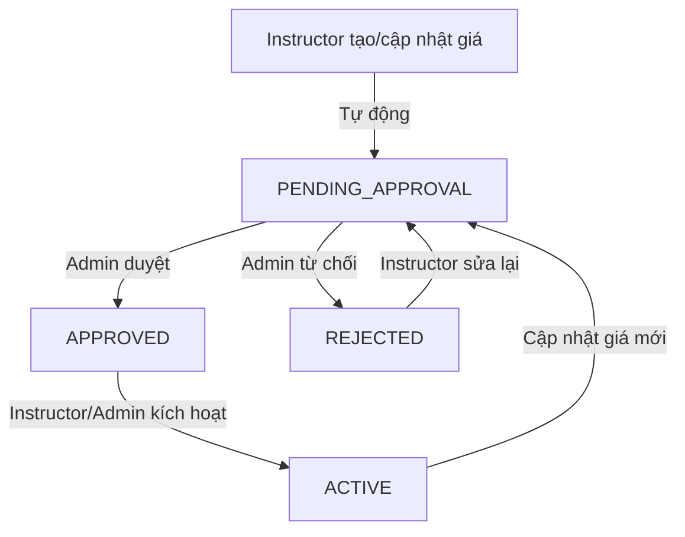

# 💰 Hệ Thống Xét Duyệt Giá Khóa Học (Price Approval System)

## 📋 Mục Lục

- [Tổng Quan](#tổng-quan)
- [Workflow Xét Duyệt Giá](#workflow-xét-duyệt-giá)
- [Thay Đổi Database Schema](#thay-đổi-database-schema)
- [API Documentation](#api-documentation)
- [Permission Matrix](#permission-matrix)
- [Examples](#examples)

---

## 🎯 Tổng Quan

Hệ thống xét duyệt giá cho phép **admin kiểm soát và duyệt giá** của các khóa học trước khi chúng có hiệu lực. Điều này đảm bảo:

✅ **Kiểm soát chất lượng giá**: Admin có thể từ chối giá không phù hợp  
✅ **Bảo vệ thương hiệu**: Tránh giá quá cao/thấp làm ảnh hưởng uy tín nền tảng  
✅ **Minh bạch**: Lưu lại toàn bộ lịch sử thay đổi và lý do từ chối  
✅ **Linh hoạt**: Instructor có thể đề xuất lại giá sau khi bị từ chối  
✅ **Truy vết đầy đủ**: Biết ai đã duyệt/từ chối và khi nào

### Luồng Chính

```
Instructor đề xuất giá → Admin xem xét → [Duyệt/Từ chối] → Kích hoạt giá
```

---

## 🔄 Workflow Xét Duyệt Giá

### Sơ Đồ Trạng Thái



### Chi Tiết Workflow

#### 1️⃣ **PENDING_APPROVAL** (Chờ Duyệt)

- **Khi nào**: Khi instructor tạo/cập nhật giá cho khóa học
- **Ai có thể thấy**: Instructor (owner), Admin
- **Hành động tiếp theo**:
  - Admin: Approve hoặc Reject
  - Instructor: Chờ phản hồi

#### 2️⃣ **APPROVED** (Đã Duyệt)

- **Khi nào**: Admin đã xem xét và chấp nhận mức giá đề xuất
- **Ai có thể thấy**: Instructor (owner), Admin
- **Hành động tiếp theo**:
  - Instructor/Admin: Activate để áp dụng giá
  - Admin: Có thể reject lại nếu cần

#### 3️⃣ **REJECTED** (Bị Từ Chối)

- **Khi nào**: Admin từ chối mức giá với lý do cụ thể
- **Ai có thể thấy**: Instructor (owner), Admin
- **Hành động tiếp theo**:
  - Instructor: Xem lý do từ chối, điều chỉnh và đề xuất lại

#### 4️⃣ **ACTIVE** (Đang Áp Dụng)

- **Khi nào**: Giá đã được duyệt và được kích hoạt
- **Ai có thể thấy**: **Tất cả mọi người** (public - hiển thị cho học viên)
- **Hành động tiếp theo**:
  - Instructor: Có thể tạo giá mới (sẽ reset về PENDING_APPROVAL)

---

## 🗄️ Thay Đổi Database Schema

### Enum Mới

```prisma
enum PriceApprovalStatus {
  PENDING_APPROVAL // Chờ admin duyệt giá
  APPROVED         // Admin đã duyệt giá
  REJECTED         // Admin từ chối giá
  ACTIVE          // Giá đã được áp dụng
}
```

### Model PricingDetail - Cập Nhật

#### Trước Đây

```prisma
model PricingDetail {
  id        String   @id @default(uuid())
  price     Decimal  @db.Decimal(12, 2)
  createdAt DateTime @default(now())

  // Relations
  header   PricingHeader @relation(...)
  course   Course?       @relation(...)
  category Category?     @relation(...)
}
```

#### Hiện Tại

```prisma
model PricingDetail {
  id        String   @id @default(uuid())
  price     Decimal  @db.Decimal(12, 2)
  createdAt DateTime @default(now())

  // 🆕 Các trường cho việc xét duyệt giá
  approvalStatus   PriceApprovalStatus @default(PENDING_APPROVAL)
  rejectionReason  String?             // Lý do từ chối (nếu bị reject)
  submittedAt      DateTime?           // Thời điểm instructor gửi duyệt
  reviewedAt       DateTime?           // Thời điểm admin xem xét
  approvedAt       DateTime?           // Thời điểm được duyệt
  activatedAt      DateTime?           // Khi giá bắt đầu có hiệu lực

  // 🆕 Thông tin người xét duyệt và tạo
  reviewedBy       User? @relation("PriceReviewer", fields: [reviewedById], references: [id])
  reviewedById     String?
  createdBy        User? @relation("PriceCreator", fields: [createdById], references: [id])
  createdById      String?

  // Relations (unchanged)
  header   PricingHeader @relation(...)
  course   Course?       @relation(...)
  category Category?     @relation(...)
}
```

### User Model - Thêm Relations

```prisma
model User {
  // ... existing fields

  // 🆕 Quan hệ với price approval
  reviewedPrices        PricingDetail[] @relation("PriceReviewer")
  createdPrices         PricingDetail[] @relation("PriceCreator")
}
```

---

## 📡 API Documentation

### 🎓 Instructor APIs

#### 1. Submit Price for Approval

Gửi giá để admin duyệt.

```http
POST /courses/prices/:priceDetailId/submit-for-approval
Authorization: Bearer {instructor_token}
```

**Request:**

```bash
curl -X POST https://api.example.com/courses/prices/price123/submit-for-approval \\
  -H "Authorization: Bearer {instructor_token}"
```

**Response:**

```json
{
  "id": "price123",
  "price": 1500000,
  "approvalStatus": "PENDING_APPROVAL",
  "submittedAt": "2025-01-20T10:00:00Z",
  "rejectionReason": null,
  "course": {
    "id": "course123",
    "title": "React Advanced Course"
  }
}
```

**Validation:**

- ✅ Chỉ instructor sở hữu course mới có thể submit
- ✅ Price status phải là `PENDING_APPROVAL` hoặc `REJECTED`

---

#### 2. Activate Approved Price

Kích hoạt giá đã được duyệt.

```http
POST /courses/prices/:priceDetailId/activate
Authorization: Bearer {instructor_token}
```

**Request:**

```bash
curl -X POST https://api.example.com/courses/prices/price123/activate \\
  -H "Authorization: Bearer {instructor_token}"
```

**Response:**

```json
{
  "id": "price123",
  "price": 1500000,
  "approvalStatus": "ACTIVE",
  "approvedAt": "2025-01-20T11:00:00Z",
  "activatedAt": "2025-01-20T12:00:00Z"
}
```

**Validation:**

- ✅ Chỉ instructor sở hữu course hoặc admin mới có thể activate
- ✅ Price status phải là `APPROVED`

---

#### 3. Get Price History

Xem lịch sử giá của khóa học.

```http
GET /courses/:courseId/price-history
Authorization: Bearer {instructor_token}
```

**Response:**

```json
{
  "data": [
    {
      "id": "price123",
      "price": 1500000,
      "approvalStatus": "ACTIVE",
      "submittedAt": "2025-01-20T10:00:00Z",
      "reviewedAt": "2025-01-20T11:00:00Z",
      "activatedAt": "2025-01-20T12:00:00Z",
      "header": {
        "name": "Regular Pricing",
        "type": "BASE_PRICE"
      },
      "reviewedBy": {
        "name": "Admin User",
        "email": "admin@example.com"
      }
    },
    {
      "id": "price122",
      "price": 2000000,
      "approvalStatus": "REJECTED",
      "submittedAt": "2025-01-19T10:00:00Z",
      "reviewedAt": "2025-01-19T15:00:00Z",
      "rejectionReason": "Giá quá cao so với thị trường. Vui lòng điều chỉnh xuống mức 1.5M - 1.8M VNĐ."
    }
  ]
}
```

---

### 👨‍💼 Admin APIs

#### 4. Approve Price

Duyệt giá của instructor.

```http
POST /courses/prices/:priceDetailId/approve
Authorization: Bearer {admin_token}
```

**Request:**

```bash
curl -X POST https://api.example.com/courses/prices/price123/approve \\
  -H "Authorization: Bearer {admin_token}"
```

**Response:**

```json
{
  "id": "price123",
  "price": 1500000,
  "approvalStatus": "APPROVED",
  "reviewedAt": "2025-01-20T11:00:00Z",
  "reviewedBy": {
    "id": "admin123",
    "name": "Admin User",
    "email": "admin@example.com"
  }
}
```

**Validation:**

- ✅ Chỉ Admin mới có thể approve
- ✅ Price status phải là `PENDING_APPROVAL`

---

#### 5. Reject Price

Từ chối giá với lý do chi tiết.

```http
POST /courses/prices/:priceDetailId/reject
Authorization: Bearer {admin_token}
Content-Type: application/json
```

**Request:**

```bash
curl -X POST https://api.example.com/courses/prices/price123/reject \\
  -H "Authorization: Bearer {admin_token}" \\
  -H "Content-Type: application/json" \\
  -d '{
    "rejectionReason": "Giá quá cao so với thị trường. Khóa học tương tự chỉ từ 1.2M - 1.5M VNĐ. Vui lòng điều chỉnh lại."
  }'
```

**Response:**

```json
{
  "id": "price123",
  "price": 2000000,
  "approvalStatus": "REJECTED",
  "reviewedAt": "2025-01-20T11:00:00Z",
  "rejectionReason": "Giá quá cao so với thị trường. Khóa học tương tự chỉ từ 1.2M - 1.5M VNĐ. Vui lòng điều chỉnh lại.",
  "reviewedBy": {
    "id": "admin123",
    "name": "Admin User"
  }
}
```

**Validation:**

- ✅ Chỉ Admin mới có thể reject
- ✅ Price status phải là `PENDING_APPROVAL`
- ✅ `rejectionReason` là bắt buộc và không được rỗng

---

#### 6. Get Pending Prices

Lấy danh sách giá chờ duyệt.

```http
GET /courses/prices/pending/list?page=1&limit=10
Authorization: Bearer {admin_token}
```

**Request:**

```bash
curl -X GET "https://api.example.com/courses/prices/pending/list?page=1&limit=10" \\
  -H "Authorization: Bearer {admin_token}"
```

**Response:**

```json
{
  "data": [
    {
      "id": "price123",
      "price": 1500000,
      "approvalStatus": "PENDING_APPROVAL",
      "submittedAt": "2025-01-20T10:00:00Z",
      "course": {
        "id": "course123",
        "title": "React Advanced Course",
        "instructor": {
          "user": {
            "name": "Instructor John",
            "email": "john@example.com",
            "image": "https://example.com/avatar.jpg"
          }
        }
      },
      "header": {
        "name": "Regular Pricing",
        "type": "BASE_PRICE"
      },
      "createdBy": {
        "name": "Instructor John",
        "email": "john@example.com"
      }
    }
  ],
  "meta": {
    "totalCount": 25,
    "page": 1,
    "limit": 10,
    "totalPages": 3,
    "hasNextPage": true,
    "hasPreviousPage": false
  }
}
```

**Query Parameters:**
| Parameter | Type | Default | Description |
|-----------|------|---------|-------------|
| `page` | number | 1 | Số trang |
| `limit` | number | 10 | Số items mỗi trang |

**Validation:**

- ✅ Chỉ Admin mới có thể xem

---

## 🔐 Permission Matrix

### Price Management Permissions

| Action                  | Instructor (Owner) | Instructor (Other) | Admin | Student |
| ----------------------- | ------------------ | ------------------ | ----- | ------- |
| Create Price Proposal   | ✅                 | ❌                 | ✅    | ❌      |
| View Own Price History  | ✅                 | ❌                 | ✅    | ❌      |
| View All Price History  | ❌                 | ❌                 | ✅    | ❌      |
| Submit for Approval     | ✅                 | ❌                 | ❌    | ❌      |
| Approve Price           | ❌                 | ❌                 | ✅    | ❌      |
| Reject Price            | ❌                 | ❌                 | ✅    | ❌      |
| Activate Approved Price | ✅                 | ❌                 | ✅    | ❌      |
| View Pending Prices     | ❌                 | ❌                 | ✅    | ❌      |
| See Active Prices       | ✅                 | ✅                 | ✅    | ✅      |

---

## 💡 Examples

### Example 1: Complete Price Approval Workflow (Happy Path)

```typescript
// 1. Instructor tạo/cập nhật giá khóa học
const priceDetail = await coursesService.setBasePrice(
  "course123",
  1500000,
  "instructor123",
);
// Status: PENDING_APPROVAL

// 2. Instructor submit để duyệt (tự động khi tạo giá)
await coursesService.submitPriceForApproval(priceDetail.id, "instructor123");
// Status: PENDING_APPROVAL (với submittedAt)

// 3. Admin duyệt giá
await coursesService.approvePriceDetail(priceDetail.id, "admin123");
// Status: APPROVED

// 4. Instructor kích hoạt giá đã duyệt
await coursesService.activatePriceDetail(priceDetail.id, "instructor123");
// Status: ACTIVE

// 5. Giá hiện đã có hiệu lực, hiển thị cho học viên
```

### Example 2: Price Rejection Flow

```typescript
// 1. Instructor đề xuất giá cao
const priceDetail = await coursesService.setBasePrice(
  "course123",
  5000000, // 5M VNĐ - quá cao
  "instructor123",
);
// Status: PENDING_APPROVAL

// 2. Admin từ chối với lý do
await coursesService.rejectPriceDetail(
  priceDetail.id,
  "admin123",
  "Giá quá cao so với thị trường. Khóa học tương tự chỉ từ 1.5M - 2M VNĐ.",
);
// Status: REJECTED

// 3. Instructor xem lý do từ chối
const history = await coursesService.getPriceHistory("course123");
console.log(history[0].rejectionReason);

// 4. Instructor điều chỉnh và đề xuất lại
const newPriceDetail = await coursesService.setBasePrice(
  "course123",
  1800000, // Giảm xuống 1.8M VNĐ
  "instructor123",
);
// Status: PENDING_APPROVAL (giá mới)
```

### Example 3: Admin Dashboard - Quản lý giá chờ duyệt

```typescript
// Admin xem tất cả giá chờ duyệt
const pendingPrices = await coursesService.getPendingPrices(1, 20);

// Duyệt hàng loạt (batch approval)
for (const price of pendingPrices.data) {
  if (price.price <= 2000000) {
    // Giá hợp lý
    await coursesService.approvePriceDetail(price.id, "admin123");
  } else {
    // Giá quá cao
    await coursesService.rejectPriceDetail(
      price.id,
      "admin123",
      `Giá ${price.price.toLocaleString()} VNĐ quá cao. Vui lòng điều chỉnh xuống dưới 2M VNĐ.`,
    );
  }
}
```

---

## 🎨 UI/UX Recommendations

### Instructor Dashboard - Price Management

```typescript
// Hiển thị trạng thái giá
const getPriceStatusBadge = (status: PriceApprovalStatus) => {
  switch(status) {
    case 'PENDING_APPROVAL':
      return <Badge color="yellow">⏳ Chờ duyệt</Badge>;
    case 'APPROVED':
      return <Badge color="green">✅ Đã duyệt</Badge>;
    case 'REJECTED':
      return <Badge color="red">❌ Bị từ chối</Badge>;
    case 'ACTIVE':
      return <Badge color="blue">🟢 Đang áp dụng</Badge>;
  }
};

// Hiển thị actions phù hợp
const getPriceActions = (priceDetail: PriceDetail) => {
  switch(priceDetail.approvalStatus) {
    case 'PENDING_APPROVAL':
      return <Text>⏳ Đang chờ admin xem xét...</Text>;

    case 'APPROVED':
      return (
        <Button onClick={() => activatePrice(priceDetail.id)}>
          🚀 Kích hoạt giá
        </Button>
      );

    case 'REJECTED':
      return (
        <div>
          <Alert type="error">
            <strong>Lý do từ chối:</strong> {priceDetail.rejectionReason}
          </Alert>
          <Button onClick={() => updatePrice(priceDetail.courseId)}>
            ✏️ Cập nhật giá mới
          </Button>
        </div>
      );

    case 'ACTIVE':
      return (
        <div>
          <Text color="success">✅ Giá đang có hiệu lực</Text>
          <Button variant="outline" onClick={() => updatePrice(priceDetail.courseId)}>
            📝 Đề xuất giá mới
          </Button>
        </div>
      );
  }
};
```

### Admin Dashboard - Price Review

```typescript
// Bảng quản lý giá chờ duyệt
const PendingPricesTable = () => {
  const [pendingPrices, setPendingPrices] = useState([]);

  const handleApprove = async (priceId: string) => {
    await approvePriceDetail(priceId);
    // Refresh list
  };

  const handleReject = async (priceId: string, reason: string) => {
    await rejectPriceDetail(priceId, reason);
    // Refresh list
  };

  return (
    <Table>
      <thead>
        <tr>
          <th>Khóa học</th>
          <th>Giảng viên</th>
          <th>Giá đề xuất</th>
          <th>Ngày gửi</th>
          <th>Hành động</th>
        </tr>
      </thead>
      <tbody>
        {pendingPrices.map(price => (
          <tr key={price.id}>
            <td>{price.course.title}</td>
            <td>{price.course.instructor.user.name}</td>
            <td>{price.price.toLocaleString()} VNĐ</td>
            <td>{formatDate(price.submittedAt)}</td>
            <td>
              <Button
                color="green"
                onClick={() => handleApprove(price.id)}
              >
                ✅ Duyệt
              </Button>
              <Button
                color="red"
                onClick={() => openRejectModal(price)}
              >
                ❌ Từ chối
              </Button>
            </td>
          </tr>
        ))}
      </tbody>
    </Table>
  );
};
```

---

## 🚀 Tích Hợp với Hệ Thống Hiện Tại

### Cập nhật Course Approval Flow

Giờ đây, để một khóa học hoàn toàn "sẵn sàng", cần:

1. ✅ **Course được duyệt**: `CourseStatus.PUBLISHED`
2. ✅ **Lessons được duyệt**: `LessonStatus.PUBLISHED`
3. ✅ **Classes được duyệt**: `ClassStatusActive.PUBLISHED`
4. ✅ **Giá được duyệt và kích hoạt**: `PriceApprovalStatus.ACTIVE`

### Updated Dashboard Statistics

```typescript
// Thống kê mới cho admin dashboard
const getApprovalStats = async () => {
  return {
    courses: {
      pending: await countCoursesByStatus("PENDING_APPROVAL"),
      published: await countCoursesByStatus("PUBLISHED"),
    },
    prices: {
      pending: await countPricesByStatus("PENDING_APPROVAL"),
      approved: await countPricesByStatus("APPROVED"),
      active: await countPricesByStatus("ACTIVE"),
      rejected: await countPricesByStatus("REJECTED"),
    },
    // ... other stats
  };
};
```

---

## 🔄 Migration Commands

```bash
# 1. Tạo migration cho price approval system
npx prisma migrate dev --name add_price_approval_system

# 2. Generate Prisma client mới
npx prisma generate

# 3. Seed database với dữ liệu mẫu
npm run seed

# 4. Restart development server
npm run start:dev
```

---

## 📊 Monitoring & Analytics

### Metrics để theo dõi

- **Approval Rate**: Tỷ lệ giá được duyệt vs từ chối
- **Average Review Time**: Thời gian trung bình admin duyệt giá
- **Price Trends**: Xu hướng giá theo category/instructor
- **Rejection Reasons**: Phân tích lý do từ chối phổ biến

### Báo cáo cho Admin

```typescript
const getPriceApprovalReport = async (dateRange: DateRange) => {
  return {
    summary: {
      totalSubmissions: 150,
      approved: 120,
      rejected: 25,
      pending: 5,
      approvalRate: '80%',
      avgReviewTime: '2.3 days'
    },
    trends: {
      byCategory: [...],
      byInstructor: [...],
      rejectionReasons: [...]
    }
  };
};
```

Hệ thống xét duyệt giá đã hoàn thành và sẵn sàng tích hợp! 🎉
